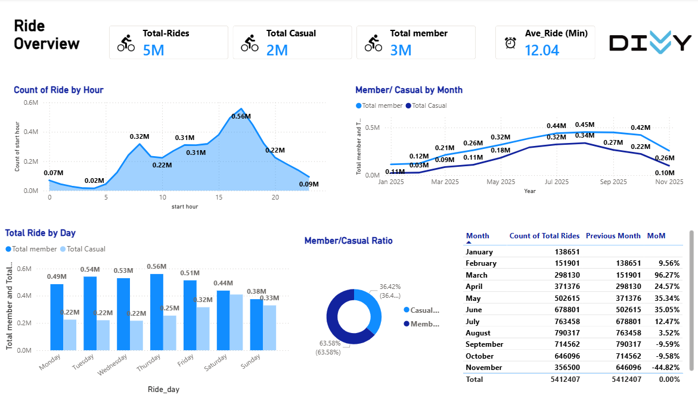

# 👋 Hi, I'm Isabell Mugo
### **Data Analyst | Business Intelligence Specialist**

I specialize in turning raw data into insights that drive efficiency, revenue, and better decision-making. From writing optimized SQL queries to building automated Power BI dashboards, I focus on solutions that scale and deliver real business value.

* **🔍 Root-Cause Analysis:** I go beyond the surface to explain *why* metrics change, providing the "so what" behind the data.
* **📊 Visual Storytelling:** I build clear, automated Power BI dashboards designed specifically for non-technical stakeholders to make data-driven decisions.
* **⚙️ Workflow Optimization:** I specialize in streamlining operations by replacing manual, error-prone Excel processes with scalable SQL-driven workflows.

---

### 🛠️ Technical Toolkit
* **Languages:** SQL (MySQL, BigQuery)
* **Tools:** Power BI (DAX, Power Query), Excel (Advanced Formulas, VBA)
* **Focus:** Data Cleaning, Trend Analysis, KPI Tracking

### 🚴‍♂️ Featured Project: Divvy Bikes Analysis
**Goal:** Analyze 5.5M+ rows of data to design a marketing strategy that converts casual riders into annual members.

### 🛠️ The Technical Workflow
Instead of manual cleaning, I built a scalable **ETL pipeline** directly in Power BI to handle the massive dataset efficiently.

* **Data Extraction & Transformation (Power Query):**
    * **Automated Appending:** Combined 12 separate monthly CSV files (Dec 2024 - Nov 2025) into a single source of truth.
    * **Data Hygiene:** Filtered out "test" station entries, handled null values, and standardized station names.
    * **Feature Engineering:** Created custom columns for `ride_length` and `day_of_week` for behavioral analysis.
* **Data Modeling (DAX):**
    * Developed measures for **Average Trip Duration** and **Total Trips** filtered by user type.
    * Built time-intelligence calculations to compare seasonal performance.

---

### 🔍 Key Insights
* **Behavioral Split:** **Members** are "Utility Riders" (peak at 8 AM/5 PM), while **Casuals** are "Leisure Riders" (peak on weekends).
* **The Opportunity:** Casual riders ride for **twice as long** as members, suggesting they value the bike for recreation.
* **Seasonal Impact:** Casual ridership drops significantly in Q4/Q1, while Member usage remains stable.

---

### 📫 Connect with me:
🤝 **LinkedIn:** [wacera-mugo-15b30a94](https://www.linkedin.com/in/wacera-mugo-15b30a94/)  
📧 **Email:** [mugwacera@gmail.com](mailto:mugwacera@gmail.com)
